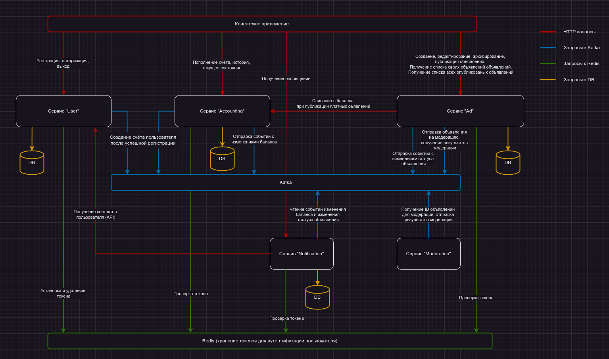

# HW-01 - Паттерны декомпозиции микросервисов

**В качестве решения предоставьте:**
* Пользовательские сценарии в свободном формате.
* Общую схему взаимодействия сервисов в свободном формате.
* Для каждого сервиса опишите назначение сервиса и его зону ответственности в свободном формате.
* Опишите контракты взаимодействия сервисов друг с другом в свободном формате.

---

## Интернет-сервис для размещения объявлений

### Пользовательские сценарии

 * Я как **пользователь** хочу <u>зарегистрироваться</u> в приложении, чтобы иметь возможность размещать свои объявления;
 * Я как **пользователь** хочу <u>авторизоваться</u> в приложении, чтобы иметь разрешения авторизованного пользователя;
 * Я как **авторизованный пользователь** хочу <u>создавать</u> **объявления**, чтобы в дальнейшем их опубликовать;
 * Я как **авторизованный пользователь** хочу <u>просматривать список</u> своих **объявлений**, чтобы видеть обобщённую информацию по ним и иметь возможность переходить в режим редактирования;
 * Я как **авторизованный пользователь** хочу <u>редактировать</u> свои **объявления**, которые не опубликованы на данный момент, чтобы исправлять ошибки и делать их более привлекательными;
 * Я как **авторизованный пользователь** хочу <u>архивировать</u> свои **объявления**, чтобы было удобнее ориентироваться в списке актуальных объявлений;
 * Я как **авторизованный пользователь** хочу <u>публиковать</u> **объявления**, чтобы их могли увидеть другие пользователи;
 * Я как **авторизованный пользователь** хочу <u>снимать с публикации</u> **объявления**, которые потеряли актуальность;
 * Я как **авторизованный пользователь** хочу <u>получать</u> **уведомления** об изменении статуса публикации **объявления**, чтобы знать о текущем статусе объявления;
 * Я как **авторизованный пользователь** хочу <u>пополнять баланс</u> своего **счёта**, чтобы иметь возможность публиковать платные объявления;
 * Я как **авторизованный пользователь** хочу <u>просматривать баланс</u> и своего **счёта**, чтобы быть в курсе текущего состояния счёта;
 * Я как **авторизованный пользователь** хочу <u>просматривать историю</u> изменения своего **счёта**, чтобы быть в курсе всех изменений счёта;
 * Я как **авторизованный пользователь** хочу <u>публиковать платные</u> **объявления**, чтобы они выделялись на фоне остальных объявлений и были более привлекательны;
 * Я как **авторизованный пользователь** хочу <u>получать</u> **уведомления** об изменении баланса своего **счёта**, чтобы знать что средства зачислены на счёт;
 * Я как **пользователь** хочу <u>просматривать опубликованные</u> **объявления** других пользователей, чтобы узнать о товарах и услугах, которые предлагают другие пользователи;
 * Я как **пользователь** хочу просматривать объявления других пользователей, которые <u>прошли</u> **модерацию**, чтобы не тратить время на "неправильные" объявления.

### Системные действия

* Регистрация
* Авторизация
* Создание объявления
* Редактирование объявления
* Архивирование объявления
* Пополнение счёта
* Списание со счёта
* Публикация объявления
* Снятие с публикации объявления
* Модерирование объявления
* Получение уведомлений

### Доменная модель

* Пользователь
* Объявление
* Баланс
* Уведомление
* Модерация

---

### Схема взаимодействия

---

### Сервис User

**Описание** 

Сервис предназначен для регистрации и авторизации пользователей. 
После создания пользователя, сервис публикует событие, на основании которого, сервис "Accounting" создаёт счёт для этого пользователя.

**Зависимости от других сервисов**

отсутствуют

**Запросы**

* `GET /api/v1/user` — информация о пользователе

**Команды**

* `POST /api/v1/register` — регистрация
* `POST /api/v1/login` — авторизация
* `POST /api/v1/logout` — выход

**События**

Сервис публикует события:
* `userCreated` — событие при создании нового пользователя

---

### Сервис Accounting

**Описание:**

Сервис предназначен для работы со счётом пользователя.

**Зависимости от других сервисов**

отсутствуют

**Запросы**

* `GET /api/v1/accounting/balance` — получение текущего состояние баланса
* `GET /api/v1/accounting/history` — получение истории изменения баланса

**Команды**

* `POST /api/v1/accounting/pay-in` — пополнение баланса
* `POST /api/v1/accounting/pay-out` — списание с баланса

**События**

Сервис публикует события:
* `balanceChanged` — событие при изменении баланса счёта

Сервис подписан на события:
* `userCreated` — событие при создании нового пользователя. В сервисе создаётся счёт для пользователя

---

### Сервис Ad

**Описание:**

Сервис предназначен для просмотра объявлений, их создания, редактирования и публикации. 

При публикации объявления, сервис отправляет объявление на модерацию в сервис "Moderation". 
При успешной модерации объявлению присваивается метка, что оно проверено. Далее, в зависимости от выбора типа объявления (платное/бесплатное), сервис отправляет запрос на оплату в сервис "Accounting".
В случае успешной оплаты, объявление публикуется. 

Если опубликованное объявление редактируется, оно снимается с публикации. Вместе с сохранением новой версии, снимается флаг, что объявление прошло модерацию. 
Флаг о том что объявление оплачено не снимается.

**Зависимости от других сервисов**

* **Accounting** — при публикации платных объявлений, со счёта списываются средства
* **Moderation** — перед публикацией объявления проходят модерацию

**Запросы**

* `GET /api/v1/list` — получение списка опубликованных объявлений (для всех пользователей, в т.ч. и гостей)
* `GET /api/v1/ad/list` — получение списка объявлений пользователя
* `GET /api/v1/ad/{id}` — получение объявления пользователя

**Команды**

* `POST /api/v1/ad/` — создание объявления пользователя
* `POST /api/v1/ad/{id}` — редактирование объявления пользователя
* `POST /api/v1/ad/pub/{id}` — публикация объявления
* `POST /api/v1/ad/unpub/{id}` — снятие с публикации объявления
* `POST /api/v1/ad/archive/{id}` — архивирование объявления
* `POST /api/v1/ad/unarchive/{id}` — возврат объявления из архива

**События**

Сервис публикует события:
* `adChanged` — событие при изменении статуса объявления
* `adNeedModerate` — событие о необходимости провести модерацию объявления

Сервис подписан на события:
* `adModerated` — событие после модерации объявления. Сервис меняет статус объявления в зависимости от результатов модерации

---

### Сервис Moderation

**Описание:**

Сервис предназначен для модерации объявлений.

**Зависимости от других сервисов**

отсутствуют

**Запросы**

отсутствуют

**Команды**

отсутствуют

**События**

Сервис публикует события:
* `adModerated` — событие с результатом модерации объявления

Сервис подписан на события:
* `adNeedModerate` — событие о необходимости провести модерацию объявления (сообщение содержит тело объявления)

---

### Сервис Notification

**Описание:**

Сервис предназначен для работы с уведомлениями. Уведомления отдаются как в клиентское приложение посредством http запроса, так и рассылаются на email, пользователей.

**Зависимости от других сервисов**

* **User** — запрашивает информацию о пользователе, чтобы узнать контактные данные

**Запросы**

- `GET /api/v1/notification/list` — получение списка новых уведомлений пользователя (запрашивает клиентское приложение)

**Команды**

- `POST /api/v1/notification/watched` — пометить уведомление просмотренным клиентским приложением

**События**

Сервис подписан на события:
* `adChanged` — событие при изменении статуса объявления - при некоторых статусах формируются уведомления
* `balanceChanged` — событие при изменении баланса счёта - формируются уведомления
---