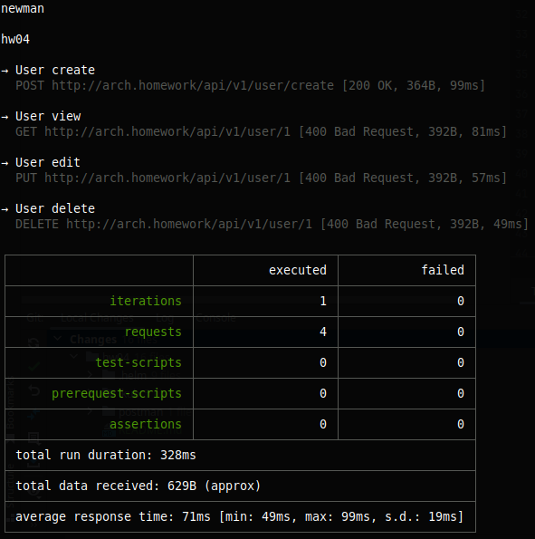

## Запуск через helm

### Запуск minikube
```shell
minikube startpp
```
### Создание namespace app
```shell
kubectl create ns app
```
### Установка postgres
```shell
helm upgrade --install app-postgres oci://registry-1.docker.io/bitnamicharts/postgresql --namespace=app -f  "./.helm/postgres/values.yaml"
```
### Запуск приложения
```shell
helm upgrade --install hw04 .helm/ -n app
```

## Запуск манифестов
```shell
kubectl apply -f .kub/
```

## Коллекция postman
### hw04/postman/collection.json
