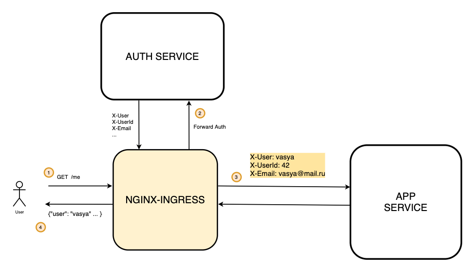
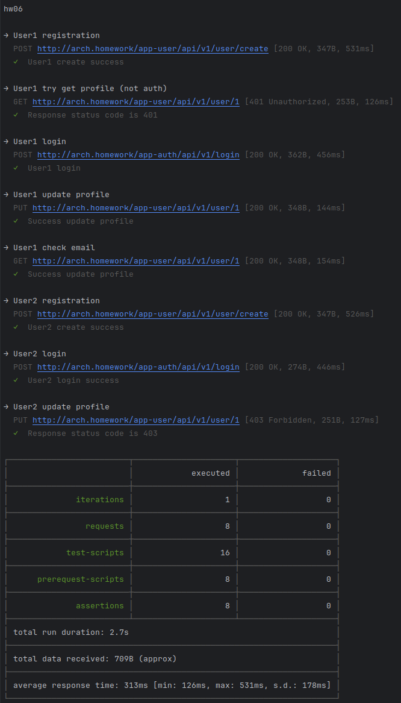

## Сценарий взаимодействия


## Коллекция postman

### Запуск тестов


```shell
newman run postman/collection.json
```

## Запуск через helm

### Запуск minikube
```shell
minikube start
```
### Создание namespace app
```shell
kubectl create ns app
```

### Включаем дополнение ingress
```shell
minikube addons enable ingress
```

### Установка и запуск приложения
```shell
helm upgrade --install app-db oci://registry-1.docker.io/bitnamicharts/postgresql -f  "./.helm/postgresql/values.yaml" -n app
helm upgrade --install app-redis oci://registry-1.docker.io/bitnamicharts/redis -f "./.helm/redis/values.yaml" -n app
helm upgrade --install app-user ./app-user/.helm/ -n app
helm upgrade --install app-auth ./app-auth/.helm/ -n app
```

### Пробрасываем порты БД
```shell
kubectl port-forward --namespace app svc/app-db-postgresql 5432:5432
```

### Пробрасываем порты redis
```shell
kubectl port-forward --namespace app svc/app-redis-master 6379:6379
```

## Удаление приложения
```shell
  helm uninstall app-user -n app
  helm uninstall app-auth -n app
  helm uninstall app-db -n app
  helm uninstall app-redis -n app
  kubectl delete pvc data-app-db-postgresql-0 -n app
```