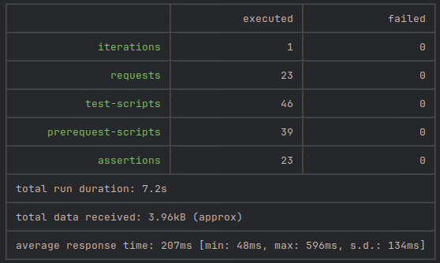

## Для реализации идемпотентности использовал шаблон ключей идемпотентности
Шаблон реализован в методах:
1. Пополнение счёта
2. Создание заказа
3. Списание средств во время создания заказа (сага)
4. Пополнение бонусного счёта во время создания заказа (сага)

## Коллекция postman

### Запуск тестов

```shell
newman run postman/collection.json
```

## Установка приложения через helm

### Запуск minikube
```shell
minikube start
```
### Создание namespace app
```shell
kubectl create ns app
```

### Включаем дополнение ingress
```shell
minikube addons enable ingress
```

### Установка и запуск приложения
```shell
helm upgrade --install app-db oci://registry-1.docker.io/bitnamicharts/postgresql -f  "./.helm/postgresql/values.yaml" -n app
helm upgrade --install app-redis oci://registry-1.docker.io/bitnamicharts/redis -f "./.helm/redis/values.yaml" -n app
helm upgrade --install app-kafka oci://registry-1.docker.io/bitnamicharts/kafka -f  "./.helm/kafka/values.yaml" -n app
helm upgrade --install app-user ./app-user/.helm/ -n app
helm upgrade --install app-auth ./app-auth/.helm/ -n app
helm upgrade --install app-billing ./app-billing/.helm/ -n app
helm upgrade --install app-bonus ./app-bonus/.helm/ -n app
helm upgrade --install app-adv ./app-adv/.helm/ -n app
helm upgrade --install app-notify ./app-notify/.helm/ -n app
```

## Удаление приложения
```shell
  helm uninstall app-user -n app
  helm uninstall app-auth -n app
  helm uninstall app-billing -n app
  helm uninstall app-bonus -n app
  helm uninstall app-adv -n app
  helm uninstall app-notify -n app
  helm uninstall app-db -n app
  helm uninstall app-redis -n app
  helm uninstall app-kafka -n app
  helm uninstall app-kafdrop -n app
  kubectl delete pvc --all -n app
  kubectl delete pv --all -n app
```


### Разработка
```shell
helm upgrade --install app-kafdrop ./.helm/kafdrop -n app
kubectl port-forward --namespace app svc/app-db-postgresql 5432:5432
kubectl port-forward --namespace app svc/app-redis-master 6379:6379
```